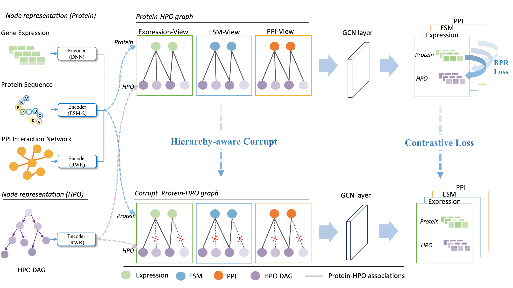

## HiHPO
HiHPO: Multimodal Hierarchical Graph Learning for Predicting Missing Protein-Phenotype Associations

## Overview
HiHPO, a novel framework designed to predict missing HPO annotations for proteins by integrating multimodal protein data, including PPI networks, gene expression profiles, and ESM sequence embeddings, with a hierarchy-aware contrastive learning module.



## Requirements

Our model is implemented with the following dependencies:

- Python == 3.8
- PyTorch == 2.3.1
- Pytorch-geometric == 2.5.3
- scikit-learn == 1.3.2
- scipy == 1.10.1
- numpy == 1.24.1
- networkx == 3.0

## 📦 Data
### Download
```bash
wget https://zenodo.org/records/19050013/files/data.zip
unzip data.zip
```
### Structure
```
data/
├── hp.obo                           # HPO ontology file
├── hpo_list.txt                     # List of HPO term IDs
├── preprocessed_expression.tsv      # Gene expression data
├── pro_list.txt                     # List of protein/gene identifiers
├── protein_embeddings_esm2_3B_36.pkl # Protein embeddings from ESM-2 (3B, layer 36)
├── network.v12.0.txt                # PPI data
├── sequences.fasta                  # Protein sequences in FASTA format
├── random/                          # Random split dataset
│   ├── hpo_similarity.npz           # HPO term similarity matrix
│   ├── ppi_mat.npz                  # Protein-protein interaction matrix
│   ├── train.txt                    # Training set (gene-HPO pairs)
│   └── test.txt                     # Test set
└── temporal/                        # Temporal split dataset
    ├── hpo_similarity.npz           # HPO term similarity matrix
    ├── ppi_mat.npz                  # Protein-protein interaction matrix
    ├── train.txt                    # Training set (gene-HPO pairs)
    └── test.txt                     # Test set
```
## 🚀 Quick Start

### Train a model

```
python main.py
```

### Available options

| Argument | Description | Default |
|----------|-------------|---------|
| `--dataset` | Dataset split type: `random` (random split) or `temporal` (temporal split) | `random` |
| `--batch_size` | Batch size for training | `2048` |
| `--lr` | Learning rate | `0.001` |
| `--n_epochs` | Number of training epochs | `100` |
| `--n_negs` | Number of negative samples per positive pair | `1` |
| `--device_id` | GPU ID for training (e.g., `0`, `1`, `2`). Use `cpu` for CPU training | `2` |
| `--alpha` | Balance parameter for contrastive loss | `0.001` |
| `--topN` | Top N predictions used for evaluation | `50` |

### Prediction
Download trained embeddings:
```bash
wget https://zenodo.org/records/19050484/files/model_weight.zip
unzip model_weight.zip
```

Use them in Python:
```bash
# Load embeddings
ckpt = torch.load('model_weight/hihpo_random.pth')

# Get protein embeddings
pro_exp = ckpt['pro_exp']
pro_esm = ckpt['pro_esm']
pro_ppi = ckpt['pro_ppi']

# Compute and combine predictions
pred_mat = sum([
    torch.matmul(pro_exp, ckpt['term_exp'].t()),
    torch.matmul(pro_esm, ckpt['term_esm'].t()),
    torch.matmul(pro_ppi, ckpt['term_ppi'].t())
]).detach().cpu().numpy()

```

#### Note: You can also replace the corresponding files in the data folder with your own data for training and prediction.